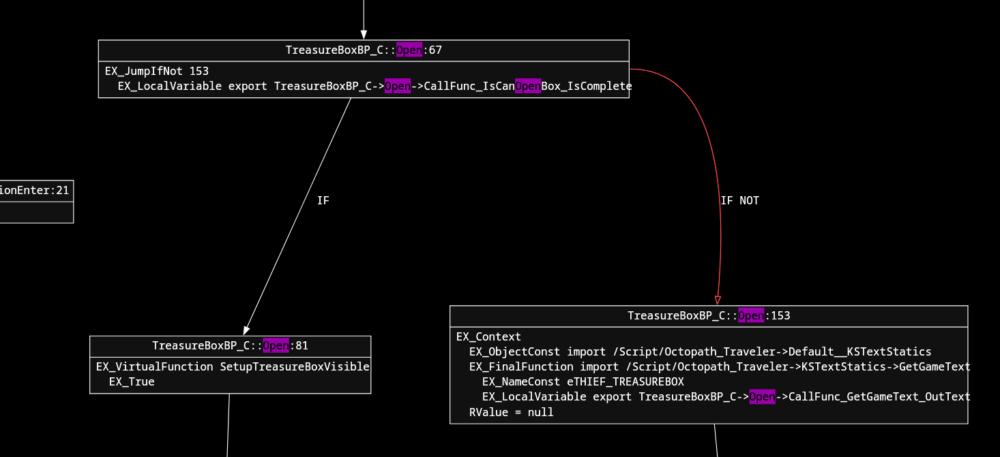

# Unlock Purple Chests

To allow anyone to be able to open purple chests, the `IsCanOpenBox` check in the `TreasureBoxBP` cooked blueprint needs to be be ignored.

Here's the part of the CFG where the `IsCanOpenBox` check is done in the `Open` function:

Some of the ways to achieve this would be to:
- Remove the `IfNot` jump bytecode instruction, but then the `ScriptBytecodeSize` would need to reflect the new size. Newer git builds of [UAssetGUI] seem to be able to handle this automatically.
- Set the `IfNot` jump offset `153` to `81` in this case, which would ensure the branch starting at `153` offset never executes.

## Tools
- [UAssetGUI]
- [kismet-analyzer](https://github.com/trumank/kismet-analyzer)

[uassetgui]: <https://github.com/atenfyr/UAssetGUI/>
